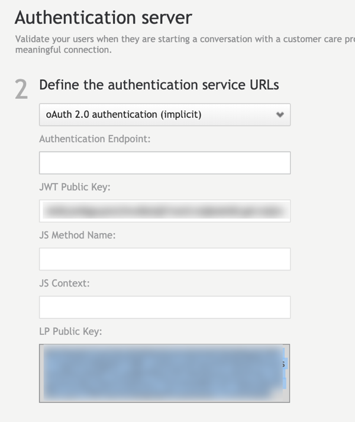
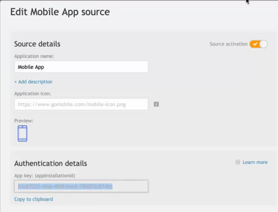

---

copyright:
  years: 2015, 2020
lastupdated: "2020-03-02"

subcollection: assistant

---

{:shortdesc: .shortdesc}
{:new_window: target="_blank"}
{:external: target="_blank" .external}
{:deprecated: .deprecated}
{:important: .important}
{:note: .note}
{:tip: .tip}
{:preview: .preview}
{:pre: .pre}
{:codeblock: .codeblock}
{:screen: .screen}
{:javascript: .ph data-hd-programlang='javascript'}
{:java: .ph data-hd-programlang='java'}
{:python: .ph data-hd-programlang='python'}
{:swift: .ph data-hd-programlang='swift'}

# Beta: Adding service desk Integrations to Web Chat
{: #beta-deploy-web-chat}

The service desks that you can connect to differ depending on whether your service instance was created as part of the early access program.
{: shortdesc}

## Setting up a Zendesk service desk integration
{: #deploy-web-chat-zendesk}

This service desk integration is available as a beta feature.

See [Zendesk](/docs/assistant?topic=assistant-deploy-web-chat#deploy-web-chat-zendesk).

## Setting up a Salesforce service desk integration
{: #deploy-web-chat-salesforce}

This service desk integration is available as a beta feature.

See the details for [Salesforce](/docs/assistant?topic=assistant-deploy-web-chat#deploy-web-chat-salesforce).

## Setting up a LiveEngage integration
{: #deploy-web-chat-liveperson}

This service desk option is available for use by participants in the early access program only. For more information about how to request access, see [Participate in the early access program](/docs/assistant?topic=assistant-feedback#feedback-beta).
{: preview}

LiveEngage is an enterprise-class platform that empowers consumers to stop wasting time on hold with 1-800 numbers and instead, message their favorite brands just as they do with friends and family. To learn more about this service desk solution, see the [LiveEngage website](https://www.liveperson.com/){: external}.

1.  If you don't have a LiveEngage account, contact a LiveEngage sales associate to create one.
1.  Create at least one campaign.

    A *campaign* is basically the name that LiveEngage uses for a project or workspace where you configure your service desk solution.

    - You must know the account number that is associated with your LiveEngage campaign. 
    - You must have administrative access to the account that you connect to the web chat.

    It might take up to 24 hours before your campaign is available. The key that you need to copy later in this procedure cannot be generated until after the creation of the account and campaign is finished.
    {: important}

1.  From the Web Chat integration page in {{site.data.keyword.conversationshort}}, switch the **Allow transfers to live agents** toggle to **On**, and then choose **LiveEngage** as the service desk type, and then click **Set up**.

1.  Enter the account number that is associated with your campaign, and then click **Access account**.
{: #deploy-web-chat-lp-authenticate}

1.  Set up authentication for chat transfers.

    When your assistant sends a transfer request to LiveEngage, it must prove to LiveEngage that the request is legitimate. To do so, add the JSON Web Token (JWT) of your assistant into the LiveEngage authentication server configuration.

    - Copy the JWT key from the Web Chat setup page.
    - Log in to LiveEngage as an administrator of your campaign, and go to *Campaigns*.
    - Click *Data Sources* from the footnote.

      
    - Click the *Integrations* tab.

      
    - Go to *Authentication Server > Configure*. 
    - In the authentication server configuration page, choose *oAuth 2.0 authentication (implicit)*.
    - In the *JWT Public Key* field, paste the assistant's token that you copied earlier.

      

      For more details, see [Authentication LiveEngage tutorial](https://developers.liveperson.com/messaging-window-api-tutorials-authentication.html){: external}.
    - Click *Save*.

1.  {: #deploy-web-chat-lp-mobile-app}Add an application to LiveEngage through which your assistant will interact with service desk personnel.

    The service desk agent interacts with your assistant through a Mobile App application that runs in LiveEngage. You must prove to {{site.data.keyword.conversationshort}} that calls from this LiveEngage mobile app are legitimate. To do so, add the App key (appinstallationId) for the LiveEngage mobile app to the Web Chat setup page in {{site.data.keyword.conversationshort}}.

    If you want to activate unauthenticated engagement attributes (Standard Data Entities or SDEs) in the Site Settings for your account, contact your LivePerson support team and ask them to enable it.
    {: note}

    - Make sure that the following features are enabled on your LiveEngage account:
    
      - Messaging
      - Authenticated chat
    - Configure the Mobile App data source in LiveEngage.

      - In LiveEngage, go to Campaigns > Data Sources > Conversation sources tab. 
      - Click *Connect* on the *Mobile App* tile. 
    - From the Edit Mobile App Source configuration page, add details about your Web app, and then click *Create*.
    - Copy the *App key* value that is generated for the app.

      
    - Paste the key into the **LiveEngage App key** field of the Web Chat setup page.

    - Add a Mobile App engagement to your campaign.

      From the campaign page in LiveEngage, click *Add engagement*, and then choose *Mobile App*.

    - If messaging is not enabled, work with the LiveEngage team to add messaging support to the mobile app.

    For more details, see [Monitoring API LiveEngage documentation](https://developers.liveperson.com/monitoring-api-getting-started.html){: external}.

1.  {: #deploy-web-chat-lp-wa-widget}Enable the assistant to share the chat history with service desk personnel.

    When a customer asks to speak to a person, your assistant transfers the in-progress conversation and a chat summary to a LiveEngage agent. To enable the service desk agent to get a quick view of the chat history between the visitor and the assistant, add the Watson Assistant integration widget to LiveEngage.

    - From the Web Chat setup configuration page, copy the **Integration widget URL**.
    - From the Visitors screen in LiveEngage, click the *Night Vision* button. 

      
    
      Overlay panes are displayed on the page. Use these modals to choose the features you want to configure.
    - Click *Agent Workspace configuration*.

      
    - Look for *Edit Widgets*, and then click the + icon to open the Integration widget.
    - Enter the name of the widget, such as **Watson Assistant**.  
    
      The widget icon is automatically generated and displays the initials of the name you chose, such as WA.
    - In the *URL* field, paste the URL that you copied in the first step of this procedure.
    - Click *Save*.

      

    From now on, when a LiveEngage agent interacts with your assistant, the widget is displayed on the page.

    For more details, see [Adding agent widgets LiveEngage documentation](https://developers.liveperson.com/add-agent-widgets-add-your-own-widgets-to-the-agent-workspace.html){: external}.
