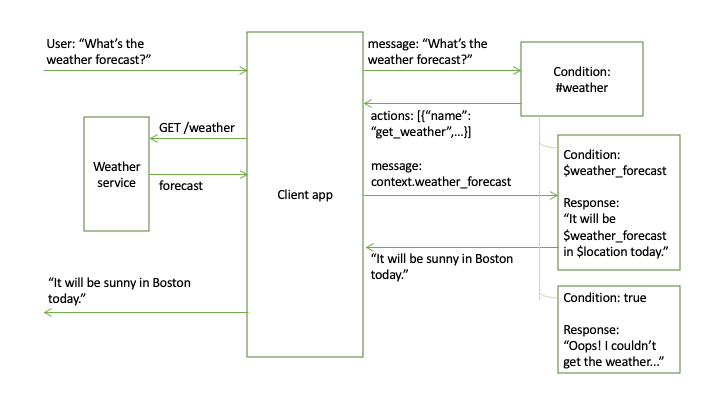
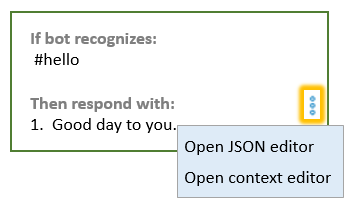

---

copyright:
  years: 2015, 2019
lastupdated: "2019-07-08"

subcollection: assistant

---

{:shortdesc: .shortdesc}
{:new_window: target="_blank"}
{:deprecated: .deprecated}
{:important: .important}
{:note: .note}
{:tip: .tip}
{:pre: .pre}
{:codeblock: .codeblock}
{:screen: .screen}
{:javascript: .ph data-hd-programlang='javascript'}
{:java: .ph data-hd-programlang='java'}
{:python: .ph data-hd-programlang='python'}
{:swift: .ph data-hd-programlang='swift'}

# Calling a client application from a dialog node 
{: #dialog-actions-client}

Add a client action to your dialog node that pauses the dialog so a client-side process can run and return a result as part of the processing that occurs within a dialog turn.
{: shortdesc}

A client action defines a programmatic call in a standardized format that your external client application can understand. Your external client application must use the provided information to run the programmatic call or function, and then return the result to the dialog.

This action does not make a direct call itself. It basically tells the dialog to pause here and wait for an external client application to go do something. The program that the client application runs can be anything that you choose. Be sure to specify the call name and parameter details, and the error message variable name according to the JSON formatting rules that are outlined later in this topic.

You can call a client application to do the following types of things:

- Validate information that you collected from the user.
- Do calculations or string manipulations on user input that are too complex for supported SpEL expression methods to handle.
- Get data from another application or service.

For information about how to call an external service, such as a {{site.data.keyword.openwhisk_short}} web action, see [Making a programmatic call from a dialog node](/docs/services/assistant?topic=assistant-dialog-webhooks).

The following diagram illustrates how you can use a client call to get weather forecast information, and return it to the user.



Note that the client action calls the `MyWeatherFunction` program, which is a program that the client application runs. The client application makes the call to the external web service (`/weather`) to get the actual forecast information. The client application then returns the response to the dialog. When you add a client action to a dialog, a client application must exist that either does the processing itself or that passes information between your dialog and any external backend services that you want to use.

## Procedure
{: #dialog-actions-client-call}

To make a programmatic call to a client application from a dialog node, complete the following steps:

1.  In the dialog node from which you want to make the programmatic call, open the JSON editor.

    - To make a programmatic call that runs after the response for a node is evaluated, open the JSON editor for the node response.

      

      If the **Multiple responses** setting is **On** for the node, then you must click the **Edit response**  icon for the **Options**  menu to be visible.

      

    If you want to display or further process the response from within the same dialog turn, then you must add a second node that does so, and jump to it from this node.
    {: tip}

    - To make a call that can be used by an individual slot, click the **Edit slot** icon  for the slot, and then do one of the following things:

      - To make a programmatic call that runs after the slot condition is evaluated to true, open the JSON editor that is associated with the slot condition.

        

      - To make a programmatic call that runs after the slot is successfully filled, open the JSON editor that is associated with the Found response. To do so, from the **Options**  menu for the slot, click **Enable conditional responses**. For the Found response, click the **Edit response**  icon. From the **Options**  menu for the Found response, click **Open JSON editor**.

        

1.  Use the following syntax to define the programmatic call.

    ```json
    {
      "context": {
        "variable_name" : "variable_value"
      },
      "actions": [
        {
          "name":"<actionName>",
          "type":"client",
          "parameters": {
            "<parameter_name>":"<parameter_value>",
            "<parameter_name>":"<parameter_value>"
          },
          "result_variable": "<result_variable_name>"
        }
      ],
      "output": {
        "text": "response text"
      }
    }
    ```
    {: codeblock}

    The `actions` array specifies the programmatic calls to make from the dialog. It can define up to five separate programmatic calls. Specify the following name and value pairs in the JSON array:

    - `<actionName>`: Required. The name of the action or service to call. Specify a name in whatever syntax you want. The goal is to specify a name that your client application will recognize and know how to handle. The name cannot be longer than 256 characters.

      For example: `calculateRate`

    - `<type>`: Indicates the type of call to make. Optionally, specify `client`, which is the default value.

      Sends a message response with programmatic call information in a standardized format that your external client application understands. Your client application must use the provided information to run the programmatic call or function, and return the result to the dialog. The JSON object in the response body specifies the service or function to call, any associated parameters to pass with the call, and the format of the result to send back.

    - `<action_parameters>`: Any parameters that are expected by the external program, which are specified as a JSON object. Parameters are only required if the external program requires them.

    - `<result_variable_name>`: The name to use to reference the JSON object that is returned by the external service or program. The result is added to the context section of the `/message` response. In other words, the result is stored as a context variable so it can be displayed in the node response or accessed by dialog nodes that are triggered later. Any existing value for the context variable is overwritten by the value that is returned by the action. You can specify the `result_variable_name` by using the following syntax:

      - `my_result`
      - `$my_result`

      The name cannot be longer than 64 characters. The variable name cannot contain the following characters: parentheses `()`, brackets (`[]`), a single quotation mark (`'`), a quotation mark (`"`), or a backslash (`\`).

      If you want to save the result to the output or input section of the `/message` response, then you can add one of the following location keywords as a prefix to the `result_variable_name`:

       - `output.`: Adds the result to the output section of the /message response. For example, `output.my_result`.
       - `input.`: Adds the result to the input section of the /message response. For example, `input.my_result`.

      You can specify a `context.` location keyword prefix also. For example, `context.my_result`. However, you do not need to because the result is added to the context by default.

      You can include periods in the variable name to create a nested JSON object. For example, you can define these variables to capture results from two separate requests to a weather service for forecasts for today and tomorrow:

      - `context.weather.today`
      - `context.weather.tomorrow`

      The results (`temp` and `rain` parameter values) are stored in the context in this structure:

      ```json
      {
        "weather": {
          "today": {
            "temp": "20",
            "rain": "30"
          },
          "tomorrow": {
            "temp": "23",
            "rain": "80"
          }
        }
      }
      ```
      {: codeblock}

      If multiple actions in a single JSON action array add the result of their programmatic call to the same context variable, then the order in which the context is updated matters. Per action type, the order in which the actions are defined in the array determines the order in which the context variable's value is set. The context variable value returned by the last action in the array overwrites the values calculated by any other actions.

## Client call example
{: #dialog-actions-client-example}

The following example shows what a call to an external weather service might look like. It is added to the JSON editor that is associated with the node response. By the time the node-level response is triggered, slots have collected and stored the date and location information from the user. This example assumes that the program that will be called is named `MyWeatherFunction`, and that it takes `location` and `date` parameters, and returns a JSON object, `{"forecast": "<value>"}`.

 ``` json
{
  "actions": [
    {
      "name": "MyWeatherFunction",
      "type": "client",
      "parameters": {
        "date": "$date",
        "location": "$location"
      },
      "result_variable": "context.my_forecast"
    }
  ]
}
```
{: codeblock}

Normally, the service only returns to the client from a POST `/message` request when new user input is required, such as after executing a parent and before executing one of its child nodes. However, if you add a client action to a node, then after evaluation, the service always returns to the client so that the result of the action call can be returned. To prevent waiting for user input when it should not, such as for a node that is configured to jump directly to a child node, the service adds the following value to the message context:

```json
  {
    "context": {
      "skip_user_input": true
    }
  }
```
{: codeblock}

If you want the client to perform an action, but not get user input, then you can follow the same convention, and add the `skip_user_input` context variable to the parent node to communicate that to the client application.

Your client application should always check for the `skip_user_input` variable on context. If present, then it knows not to request new input from the user, but instead execute the action, add its result into the message, and pass it back to the service. The new POST message request should include the message returned by the previous POST message response (namely, the context, input, intents, entities, and optionally the output section) and, instead of the JSON object that defines the programmatic call to make, it should include the result that was returned from the programmatic call.

In a child node that you jump to after this node, add the response to show the user:

``` json
{
  "output": {
    "text": {
      "values": [
        "It will be $my_forecast $date.literal in $location.literal."
      ]
    }
  }
```
{: codeblock}
