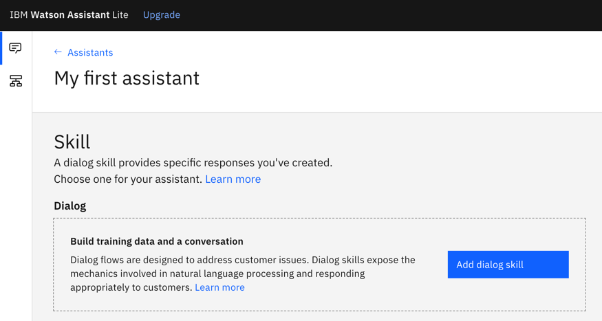
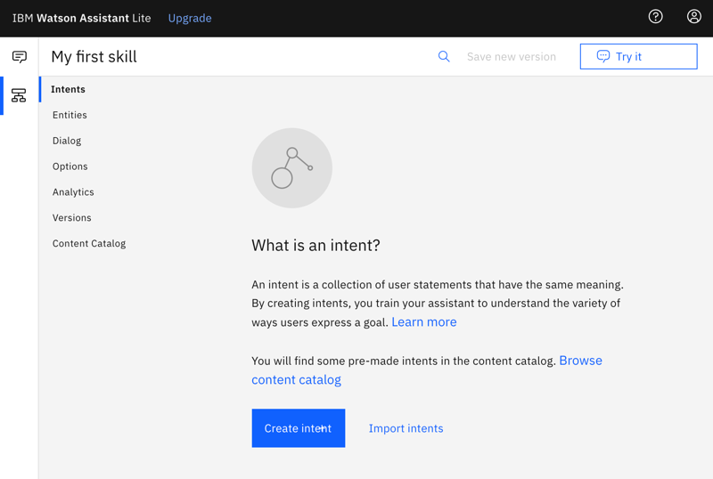
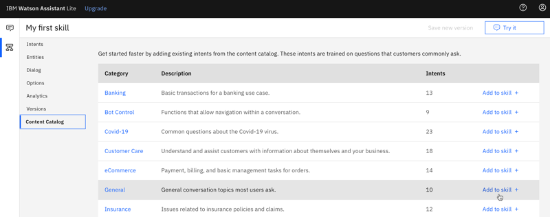
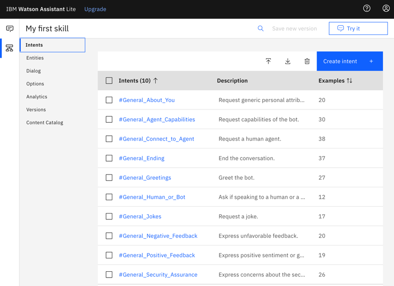
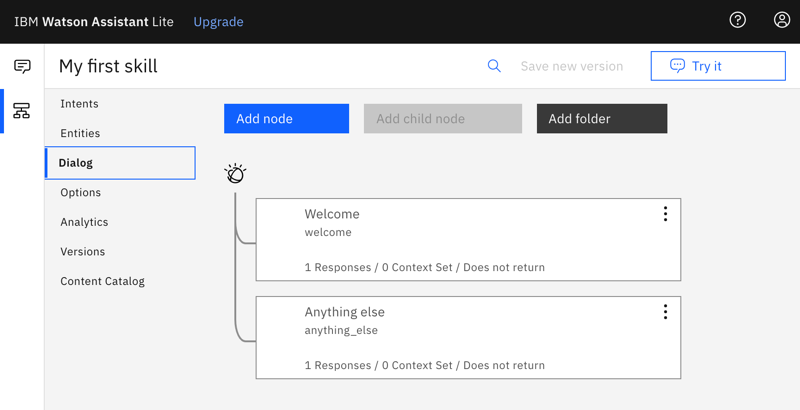
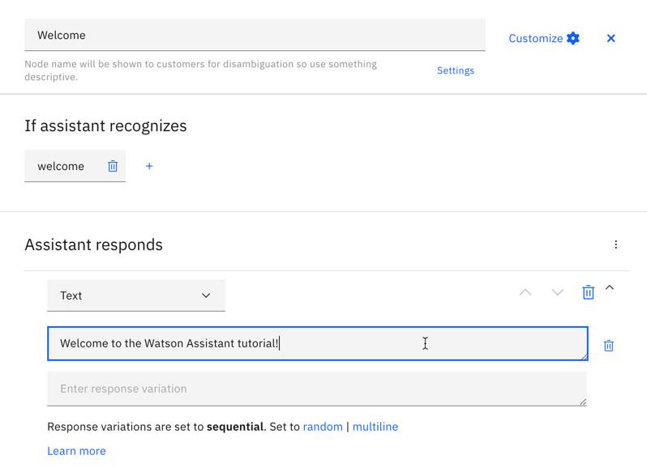
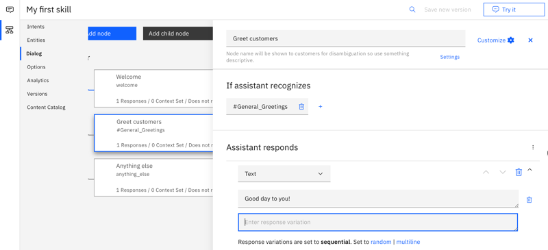
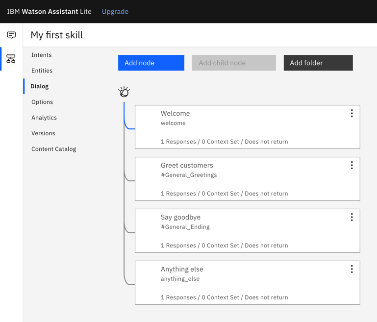
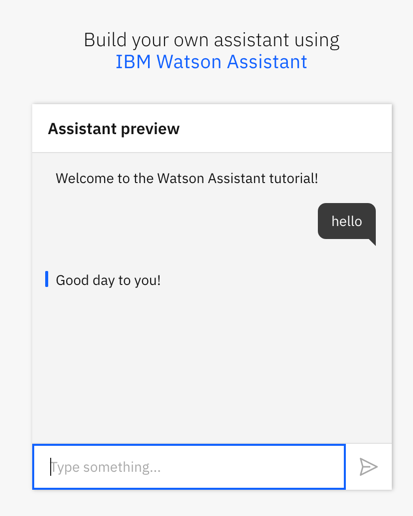

---

copyright:
  years: 2015, 2020
lastupdated: "2020-07-21"

keywords: assistant, omnichannel, virtual agent, virtual assistant, chatbot, conversation, watson assistant, watson conversation

subcollection: assistant

---

{:shortdesc: .shortdesc}
{:new_window: target="_blank"}
{:external: target="_blank" .external}
{:deprecated: .deprecated}
{:important: .important}
{:note: .note}
{:tip: .tip}
{:pre: .pre}
{:codeblock: .codeblock}
{:screen: .screen}
{:javascript: .ph data-hd-programlang='javascript'}
{:java: .ph data-hd-programlang='java'}
{:python: .ph data-hd-programlang='python'}
{:swift: .ph data-hd-programlang='swift'}
{:hide-dashboard: .hide-dashboard}
{:download: .download}
{:gif: data-image-type='gif'}

# Getting started with {{site.data.keyword.conversationshort}}
{: #getting-started}

In this short tutorial, we introduce {{site.data.keyword.conversationfull}} and walk you through the process of creating your first assistant.
{: shortdesc}

## Before you begin
{: #getting-started-prerequisites}
{: hide-dashboard}

You need a service instance to start.
{: hide-dashboard}

1.  {: hide-dashboard} Go to the [{{site.data.keyword.conversationshort}}](https://cloud.ibm.com/catalog/services/watson-assistant){: external} page in the {{site.data.keyword.cloud}} catalog.

    The service instance will be created in the **default** resource group if you do not choose a different one, and it *cannot* be changed later. This group is sufficient for the purposes of trying out the product.

    If you're creating an instance for more robust use, then learn more about [resource groups](https://{DomainName}/docs/resources/bestpractice_rgs#bp_resourcegroups){: external}.
1.  {: hide-dashboard} Sign up for a free {{site.data.keyword.cloud_notm}} account or log in.
1.  {: hide-dashboard} Click **Create**.

## Step 1: Open Watson Assistant
{: #getting-started-launch-tool}

After you create a {{site.data.keyword.conversationshort}} service instance, you land on the **Manage** page of the {{site.data.keyword.conversationshort}} dashboard.
{: hide-dashboard}

1.  Click **Launch {{site.data.keyword.conversationshort}}**. If you're prompted to log in, provide your {{site.data.keyword.cloud_notm}} credentials.

A new browser tab or window opens and the Assistants page of {{site.data.keyword.conversationshort}} is displayed.

- An assistant named **My first assistant** is created for you automatically. An *assistant* is a cognitive bot to which you add skills that enable it to interact with your customers in useful ways.

- A dialog skill named **My first skill** is added to the assistant for you automatically. A *dialog skill* is a container for the artifacts that define the flow of a conversation that your assistant can have with your customers.

If an assistant and skill are not created automatically, complete Steps 2 and 3. Otherwise, [skip to Step 4: Add intents from a content catalog](#getting-started-add-catalog).

## Step 2: Create an assistant
{: #getting-started-create-assistant}

An *assistant* is a cognitive bot to which you add skills that enable it to interact with your customers in useful ways.

1.  Click the **Assistants** icon , and then click **Create assistant**.

    
1.  Name the assistant `My first assistant`.

    
1.  Click **Create assistant**.

## Step 3: Create a dialog skill
{: #getting-started-add-skill}

A *dialog skill* is a container for the artifacts that define the flow of a conversation that your assistant can have with your customers.

1.  Click the *My first assistant* tile to open the assistant.

1.  Click **Add dialog skill**.

    

1.  Give your skill the name `My first skill`.
1.  **Optional**. If the dialog you plan to build will use a language other than English, then choose the appropriate language from the list.

    

1.  Click **Create dialog skill**.

    The skill is created and you return to the assistant page.

    

1.  Click to open the skill you just created.

## Step 4: Add intents from a content catalog
{: #getting-started-add-catalog}

When you open the *My first skill*, you land on the *Intents* page.

If available in your location, a tour begins that you can step through to learn about the product. Follow the tour; it provides a great overview of the product.

Add training data that was built by IBM to your skill by adding intents from a content catalog. In particular, you will give your assistant access to the **General** content catalog so your dialog can greet users, and end conversations with them.

1.  Click the **Content Catalog** tab.

1.  Find **General** in the list, and then click **Add to skill**.

    
1.  Open the **Intents** tab to review the intents and associated example utterances that were added to your training data. You can recognize them because each intent name begins with the prefix `#General_`. You will add the `#General_Greetings` and `#General_Ending` intents to your dialog in the next step.

    

You successfully started to build your training data by adding prebuilt content from {{site.data.keyword.IBM_notm}}.

## Step 5: Build a dialog
{: #getting-started-build-dialog}

A [dialog](/docs/assistant?topic=assistant-dialog-overview) defines the flow of your conversation in the form of a logic tree. It matches intents (what users say) to responses (what the bot says back). Each node of the tree has a condition that triggers it, based on user input.

We'll create a simple dialog that handles greeting and ending intents, each with a single node.

### Adding a start node

1.  From the Skills menu, click **Dialog**.
1.  Click **Create dialog**. You see two nodes:
    - **Welcome**: Contains a greeting that is displayed to your users when they first engage with the assistant.
    - **Anything else**: Contains phrases that are used to reply to users when their input is not recognized.

    
1.  Click the **Welcome** node to open it in the edit view.
1.  Replace the default response with the text, `Welcome to the Watson Assistant tutorial!`.

    
1.  Click  to close the edit view.

You created a dialog node that is triggered by the `welcome` condition. (`welcome` is a special condition that functions like an intent, but does not begin with a `#`.) It is triggered when a new conversation starts. Your node specifies that when a new conversation starts, the system should respond with the welcome message that you add to the response section of this first node.

### Testing the start node

You can test your dialog at any time to verify the dialog. Let's test it now.

- Click the  icon to open the "Try it out" pane. You should see your welcome message.

### Adding nodes to handle intents

Now let's add nodes between the `Welcome` node and the `Anything else` node that handle our intents.

1.  Click the More icon  on the **Welcome** node, and then select **Add node below**.
1.  In the **If assistant recognizes** field of this node, start to type `#General_Greetings`. Then, select the **`#General_Greetings`** option.
1.  Add the response text, `Good day to you!`

    
1.  Click  to close the edit view.
1.  Click the More icon  on this node, and then select **Add node below** to create a peer node. In the peer node, specify `#General_Ending` in the **If assistant recognizes** field, and `OK. See you later.` as the response text.
1.  Click  to close the edit view.

   

### Testing intent recognition

You built a simple dialog to recognize and respond to both greeting and ending inputs. Let's see how well it works.

1.  Click the  icon to open the "Try it out" pane. There's that reassuring welcome message.
1.  In the text field, type `Hello` and then press Enter. The output indicates that the `#General_Greetings` intent was recognized, and the appropriate response (`Good day to you.`) is displayed.
1.  Try the following input:
    - `bye`
    - `howdy`
    - `see ya`
    - `good morning`
    - `sayonara`

    {: gif width="600"}

    {{site.data.keyword.watson}} can recognize your intents even when your input doesn't exactly match the examples that you included. The dialog uses intents to identify the purpose of the user's input regardless of the precise wording used, and then responds in the way you specify.

### Result of building a dialog

That's it. You created a simple conversation with two intents and a dialog to recognize them.

## Step 6: Integrate the assistant
{: #getting-started-integrate-assistant}

Now that you have an assistant that can participate in a simple conversational exchange, test it.

1.  Click the **Assistants** icon  to open a list of your assistants.
1.  Find the *My first assistant* assistant, and open it.
1.  Test your assistant with a preview link integration. 

    The preview link integration builds your assistant into a chat widget that is hosted by an IBM-branded web page. You can open the web page and chat with your assistant to test it out. 
    
1.  If a *My first assistant* assistant was created for you, then you must add a preview link integration. From the *Integrations* area, click **Add integration**, and then click **Preview link**. Click **Create**.

    When you you create an assistant yourself, you can skip this step. A preview link integration is added to the assistant for you automatically. Click the preview link integration tile to open it.

1.  Click the URL that is displayed on the page.

    The test web page opens in a new tab. You can start submitting message to see how your assistant responds. 

    With a Lite plan, you can use the service for free. With other plans, you are charged for messages that you submit from the preview link integration. You can review metrics about the test user conversations from the Analytics page. You are not charged for messages that you submit from the "Try it out" pane, and the exchanges you have there are not logged.
    {: note}

1.  Type `hello` into the text field, and watch your assistant respond. 

    

    You can share the URL with others who might want to try out your assistant.

1.  After testing, close the web page. Click the **X** to close the preview link integration page.

## Next steps
{: #getting-started-next-steps}

This tutorial is built around a simple example. For a real application, you need to define some more interesting intents, some entities, and a more complex dialog that uses them both. When you have a polished version of the assistant, you can integrate it with web sites or channels, such as Slack, that your customers already use. As traffic increases between the assistant and your customers, you can use the tools that are provided in the **Analytics** page to analyze real conversations, and identify areas for improvement.

- Complete follow-on tutorials that build more advanced dialogs:

    - Add more dialog nodes to design complex conversational exchanges. See [Building a complex dialog](/docs/assistant?topic=assistant-tutorial).
    - Learn techniques for getting customers to share information that the assistant needs before it can provide a useful response. See [Adding a node with slots](/docs/assistant?topic=assistant-tutorial-slots).

- Check out more [sample apps](/docs/assistant?topic=assistant-sample-apps) to get ideas.
