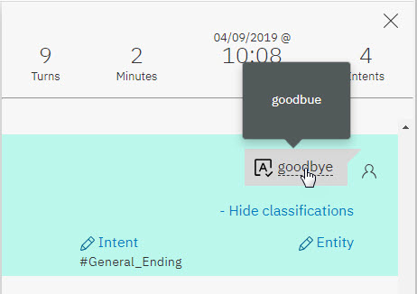
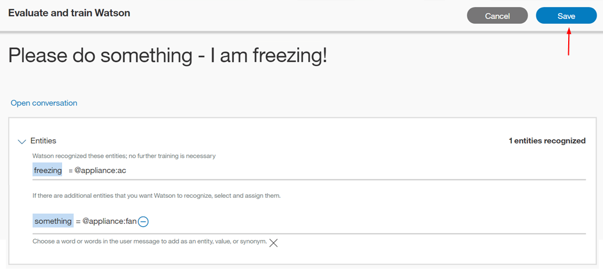

---

copyright:
  years: 2015, 2020
lastupdated: "2020-08-19"

keywords: mark as irrelevant, counterexample, data source, deployment ID

subcollection: assistant

---

{:shortdesc: .shortdesc}
{:new_window: target="_blank"}
{:external: target="_blank" .external}
{:deprecated: .deprecated}
{:important: .important}
{:note: .note}
{:tip: .tip}
{:pre: .pre}
{:codeblock: .codeblock}
{:screen: .screen}
{:javascript: .ph data-hd-programlang='javascript'}
{:java: .ph data-hd-programlang='java'}
{:python: .ph data-hd-programlang='python'}
{:swift: .ph data-hd-programlang='swift'}

# Improve your skill
{: #logs}

The Analytics page of {{site.data.keyword.conversationshort}} provides a history of conversations between users and a deployed assistant. You can use this history to improve how your assistants understand and respond to user requests.
{: shortdesc}

To open a list of individual messages between customers and the assistant that uses this dialog skill, select **User conversations** in the navigation bar.

When you open the **User conversations** page, the default view lists inputs that were submitted to the assistant for the last day, with the newest results first. The top intent (#intent) and any recognized entity (@entity) values used in a message, and the message text are available. For intents that are not recognized, the value shown is *Irrelevant*. If an entity is not recognized, or has not been provided, the value shown is *No entities found*.


The User conversations page displays the total number of *messages* between customers and your assistant. A message is a single utterance that a user sends to the assistant. A conversation typically consists of multiple messages. Therefore, the number of results on the **User conversations** page is different from the number of conversations that are shown on the **Overview** page.
{: important}

## Log limits
{: #logs-limits}

The length of time for which messages are retained depends on your {{site.data.keyword.conversationshort}} service plan:

  Service plan                         | Chat message retention
  ------------------------------------ | ------------------------------------
  Premium                              | Last 90 days
  Plus                                 | Last 30 days
  Standard (legacy)                    | Last 30 days
  Plus Trial                           | Last 30 days
  Lite                                 | Last 7 days

## Filtering messages
{: #logs-filter-messages}

You can filter messages by *Search user statements*, *Intents*, *Entities*, and *Last n days*.

*Search user statements* - Type a word in the search bar. This searches the users' inputs, but not your assistant's replies.

*Intents* - Select the drop-down menu and type an intent in the input field, or choose from the populated list. You can select more than one intent, which filters the results using any of the selected intents, including *Irrelevant*.


*Entities* - Select the drop-down menu and type an entity name in the input field, or choose from the populated list. You can select more than one entity, which filters the results by any of the selected entities. If you filter by intent *and* entity, your results will include the messages that have both values. You can also filter for results with *No entities found*.


Messages might take some time to update. Allow at least 30 minutes after a user's interaction with your assistant before attempting to filter for that content.

## Viewing individual messages
{: #logs-see-message}

For any user input entry, click **Open conversation** to see the user input and the response made to it by the assistant within the context of the full conversation.

The time that is shown for each conversation is localized to reflect the time zone of your browser. This time might differ from the timestamp shown if you review the same conversation log via an API call; API log calls are always shown in UTC.


You can then choose to show the classification(s) for the message you selected.


If the spell check feature is enabled for the skill, then any user utterances that were corrected are highlighted by the Auto-correct icon. The term that was corrected is underlined. You can hover over the underlined term to see the user's original input.



## Improving across assistants
{: #logs-deploy-id}

Creating a dialog skill is an iterative process. While you develop your skill, you use the *Try it out* pane to verify that your assistant recognizes the correct intents and entities in test inputs, and to make corrections as needed.

From the User conversations page, you can analyze actual interactions between the assistant you used to deploy the skill and your users. Based on those interactions, you can make corrections to improve the accuracy with which intents and entities are recognized by your dialog skill. It is difficult to know exactly *how* your users will ask questions, or what random messages they might submit, so it is important to frequently analyze real conversations to improve your dialog skills.

For a {{site.data.keyword.conversationshort}} instance that includes multiple assistants, there might be times when it is useful to use message data from the dialog skill of one assistant to improve the dialog skill used by another assistant within that same instance.

As an example, say you have a {{site.data.keyword.conversationshort}} instance named *HelpDesk*. You might have both a Production assistant and a Development assistant in your HelpDesk instance. When working in the dialog skill for the Development assistant, you can use logs from the Production assistant messages to improve the Development assistant's dialog skill.

Any edits you then make within the dialog skill for the Development assistant will only affect the Development assistant's dialog skill, even though you’re using data from messages sent to the Production assistant.

Similarly, if you create multiple versions of a skill, you might want to use message data from one version to improve the training data of another version.

You cannot access log data from assistants that were created in other service instances.

### Picking a data source
{: #logs-pick-data-source}

The term *data source* refers to the logs compiled from conversations between customers and the assistant or custom application by which a dialog skill was deployed.

When you open the *Analytics* page, metrics are shown that were generated by user interactions with the current dialog skill. No metrics are shown if the current skill has not been deployed and used by customers.

To populate the metrics with message data from a dialog skill or skill version that was added to a different assistant or custom application, one that has interacted with customers, complete these steps:

1.  Click the **Data source** field to see a list of assistants with log data that you might want to use.

    The list includes assistants that have been deployed and to which you have access. Or you can choose to show a list of other deployments. For more information about other types of deployments, see [*Show deployment IDs* explained](#logs-deployment-id-explained).

1.  Choose a data source.

Statistical information for the selected data source is displayed.

Notice the list does not include skill versions. To get data that is associated with a specific skill version, you must know the time frame during which a specific skill version was used by a deployed assistant. You can select the assistant as the data source, and then filter the metrics by the appropriate dates to see only log data that was generated by the assistant while it was using the skill version.

### *Show deployment IDs* explained
{: #logs-deployment-id-explained}

Applications that use the older v1 runtime API must specify a deployment ID in each messages sent using the `/message` API. This ID identifies the deployed app that the call was made from. The Analytics page can use this deployment ID to retrieve and display logs that are associated with a specific live application.

For assistants or custom apps that use the v2 version of the API, your assistant automatically includes an assistant ID with each /message call, so you can choose a data source by assistant name instead of using a deployment ID.

To add the deployment ID, v1 API users include the deployment property inside the metadata of the [context](https://cloud.ibm.com/apidocs/assistant/assistant-v1?curl=#message){: external}, as in this example:

```json
"context" : {
  "metadata" : {
       "deployment": "HelpDesk-Production"
  }
}
```
{: codeblock}

 For premium {{site.data.keyword.conversationshort}} instances that use the v1 API and specify a deployment ID with each /message call, you can ask IBM to configure your instances to allow you to access log data from deployed applications across different instances. (If your instances use the v2 API, you cannot get log data from across different instances.)

If log sharing is enabled, only someone with Manager service access to the current instance can view logs. The person can view logs from all of the instances that are being shared. Logs from across all of the participating instances are displayed, regardless of the current user's service level access to the other instances. Similarly, when someone with Manager service access to an instance sends a GET request to the v1 `/logs` API endpoint, logs from all instances that participate in log sharing are returned, regardless of the user's service level access to each instance.
{: note}

## Making training data improvements
{: #logs-fix-data}

Use insights from real user conversations to correct the model associated with your dialog skill.

If you use data from another data source, any improvements you make to the model are applied to the current dialog skill only. The **Data source** field shows the source of the messages you are using to improve this dialog skill, and the header of the page shows the dialog skill you are applying changes to.

### Correcting an intent
{: #logs-correct-intent}

1.  To correct an intent, select the  edit icon for the chosen #intent.
1.  From the list provided, select the correct intent for this input.
    - Begin typing in the entry field and the list of intents is filtered.
    - You can also choose **Mark as irrelevant** from this menu. (For more information, see [Teaching your assistant about topics to ignore](#logs-mark-irrelevant).) Or, you can choose **Do not train on intent**, which does not save this message as an example for training.

    
1.  Select **Save**.

    

    The {{site.data.keyword.conversationshort}} service supports adding user input as an example to an intent *as-is*. If you are using @entity references as examples in your intent training data, and a user message that you want to save contains an entity value or synonym from your training data, then you must edit the message later. After you save it, edit the message from the Intents page to replace the entity that it references. For more information, see [Directly referencing an @Entity as an intent example](/docs/assistant?topic=assistant-intents#intents-entity-as-example).
    {: tip}

### Adding an entity value or synonym
{: #logs-add-entity}

1.  To add an entity value or synonym, select the  edit icon for the chosen @entity.
1.  Select **Add entity**.

    
1.  Now, select a word or phrase in the underlined user input.

    
1.  Choose an entity to which the highlighted phrase will be added as a value.
    - Begin typing in the entry field and the list of entities and values is filtered.
    - To add the highlighted phrase as a synonym for an existing value, choose the `@entity:value` from the drop-down list.

    
1.  Select **Save**.

    

### Teaching your assistant about topics to ignore
{: #logs-mark-irrelevant}

It is important to help your assistant stay focused on the types of customer questions and business transactions you have designed it to handle. You can use information collected from real customer conversations to highlight subjects that you do not want your assistant to even attempt to address.

For more information, see [Defining what's irrelevant](/docs/assistant?topic=assistant-irrelevance-detection).
