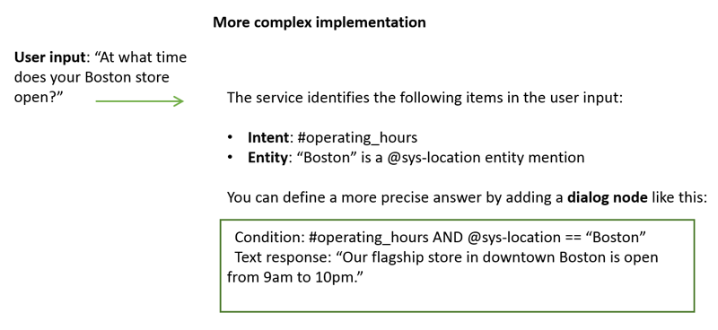

---

copyright:
  years: 2015, 2019
lastupdated: "2019-02-13"

---

{:shortdesc: .shortdesc}
{:new_window: target="_blank"}
{:deprecated: .deprecated}
{:important: .important}
{:note: .note}
{:tip: .tip}
{:pre: .pre}
{:codeblock: .codeblock}
{:screen: .screen}
{:javascript: .ph data-hd-programlang='javascript'}
{:java: .ph data-hd-programlang='java'}
{:python: .ph data-hd-programlang='python'}
{:swift: .ph data-hd-programlang='swift'}

# Skills
{: #skills}

A dialog skill contains the training data and logic that enables an assistant to help your customers.
{: shortdesc}

A dialog skill contains the following types of artifacts:

- [**Intents**](/docs/services/assistant/intents.html): An *intent* represents the purpose of a user's input, such as a question about business locations or a bill payment. You define an intent for each type of user request you want your application to support. In the tool, the name of an intent is always prefixed with the `#` character. To train the dialog skill to recognize your intents, you supply lots of examples of user input and indicate which intents they map to.

  A *content catalog* is provided that contains prebuilt common intents you can add to your application rather than building your own. For example, most applications require a greeting intent that starts a dialog with the user. You can add the **General** content catalog to add an intent that greets the user and does other useful things, like end the conversation.

- [**Dialog**](/docs/services/assistant/dialog-build.html): A *dialog* is a branching conversation flow that defines how your application responds when it recognizes the defined intents and entities. You use the dialog builder in the tool to create conversations with users, providing responses based on the intents and entities that you recognize in their input.
- [**Entities**](/docs/services/assistant/entities.html); An *entity* represents a term or object that is relevant to your intents and that provides a specific context for an intent. For example, an entity might represent a city where the user wants to find a business location, or the amount of a bill payment. In the tool, the name of an entity is always prefixed with the `@` character. To train the dialog skill to recognize your entities, you list the possible values for each entity and synonyms that users might enter.

As you add information, the skill uses this unique data to build a machine learning model that can recognize these and similar user inputs. Each time you add or change the training data, the training process is triggered to ensure that the underlying model stays up-to-date as your customer needs and the topics they want to discuss change.

For help creating a dialog skill, see [Creating a skill](/docs/services/assistant/skill-add.html).

Here are some examples.

