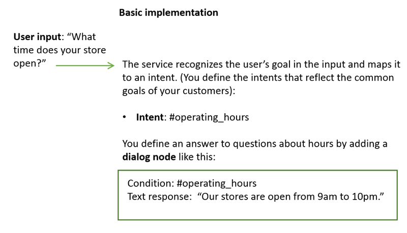

---

copyright:
  years: 2015, 2020
lastupdated: "2019-08-02"

subcollection: assistant

---

{:shortdesc: .shortdesc}
{:new_window: target="_blank"}
{:deprecated: .deprecated}
{:important: .important}
{:note: .note}
{:tip: .tip}
{:pre: .pre}
{:codeblock: .codeblock}
{:screen: .screen}
{:javascript: .ph data-hd-programlang='javascript'}
{:java: .ph data-hd-programlang='java'}
{:python: .ph data-hd-programlang='python'}
{:swift: .ph data-hd-programlang='swift'}

# Skills
{: #skills}

A skill is a container for the artificial intelligence that enables an assistant to help your customers.
{: shortdesc}

An assistant directs requests down the optimal path for solving a customer problem. Add skills so your assistant can provide a direct answer to a common question or reference more generalized search results for something more complex.

## Skill types
{: #skills-types}

You can add the following type of skill to your assistant:

- **[Dialog skill](#skills-dialog-skill)**: Understands typical questions or requests from users and answers or fulfills them by following a dialog that is scripted by you.

 If you are a Plus or Premium plan user, you can also create this type of skill:

- **[Search skill](#skills-search-skill)**: Answers a user's question by searching for relevant information from an external data source, extracting the passage, and returning it as the assistant's response.

### Dialog skill
{: #skills-dialog-skill}

A dialog skill contains the training data and logic that enables an assistant to help your customers. It contains the following types of artifacts:

- [**Intents**](/docs/services/assistant?topic=assistant-intents): An *intent* represents the purpose of a user's input, such as a question about business locations or a bill payment. You define an intent for each type of user request you want your application to support. The name of an intent is always prefixed with the `#` character. To train the dialog skill to recognize your intents, you supply lots of examples of user input and indicate which intents they map to.

  A *content catalog* is provided that contains prebuilt common intents you can add to your application rather than building your own. For example, most applications require a greeting intent that starts a dialog with the user. You can add the **General** content catalog to add an intent that greets the user and does other useful things, like end the conversation.

- [**Dialog**](/docs/services/assistant?topic=assistant-dialog-build): A *dialog* is a branching conversation flow that defines how your application responds when it recognizes the defined intents and entities. You use the dialog editor to create conversations with users, providing responses based on the intents and entities that you recognize in their input.

  

To enable your dialog skill to handle more nuanced questions, define entities and reference them from your dialog.

- [**Entities**](/docs/services/assistant?topic=assistant-entities); An *entity* represents a term or object that is relevant to your intents and that provides a specific context for an intent. For example, an entity might represent a city where the user wants to find a business location, or the amount of a bill payment. The name of an entity is always prefixed with the `@` character.

  You can train the skill to recognize your entities by providing entity term values and synonyms, entity patterns, or by identifying the context in which an entity is typically used in a sentence. To fine tune your dialog, go back and add nodes that check for entity mentions in user input in addition to intents.

As you add information, the skill uses this unique data to build a machine learning model that can recognize these and similar user inputs. Each time you add or change the training data, the training process is triggered to ensure that the underlying model stays up-to-date as your customer needs and the topics they want to discuss change.

For help creating a dialog skill, see [Creating a dialog skill](/docs/services/assistant?topic=assistant-skill-dialog-add).

### Search skill 
{: #skills-search-skill}

When Watson Assistant doesn't have an explicit solution to a problem, it routes the user question to a search skill to find an answer from across your disparate sources of self-service content. The search skill interacts with the {{site.data.keyword.discoveryfull}} service to extract this information from a configured data collection.

If you already use the {{site.data.keyword.discoveryshort}} service, you can mine your existing data collections for source material that you can share with customers to address their questions.

However, you do not need to have a {{site.data.keyword.discoveryshort}} service instance. If you choose to create a search skill, a free instance of {{site.data.keyword.discoveryshort}} is provisioned for you. You can then create a collection from a data source and configure your search skill to search this collection to find answers to customer queries.

The following diagram illustrates how user input is processed when both a dialog skill and a search skill are added to an assistant. Any questions that the dialog is not designed to answer are sent to the search skill, which finds a relevant response from a {{site.data.keyword.discoveryshort}} data collection.

For help creating a search skill, see [Creating a search skill](/docs/services/assistant?topic=assistant-skill-search-add).